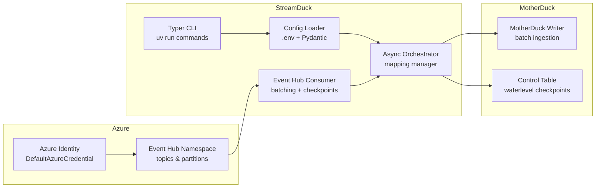

# streamduck

***Note: This is a work in progress. The code and documentation may change frequently.***

Steps to run:

1. Clone the repository.
2. Copy `.env.example` to `.env` and fill it out. The pipeline relies on the Azure Default Credential chain, so make sure you are logged in with `az login` (or equivalent) and have access to the target Event Hubs namespace.
3. Run `uv run python src/main.py validate-config` to verify configuration and credentials.
4. Run `uv run python src/main.py run` to start the pipeline.

## Architecture

